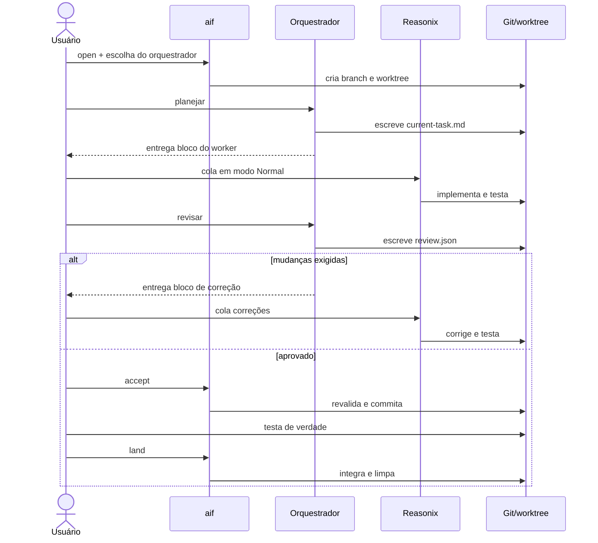

# Arquitetura do aif

Este documento descreve a arquitetura vigente do framework a partir da versão
1.3.0. O passo a passo de operação fica em `PASSO-A-PASSO.md`; as razões das
decisões estruturais ficam nos registros em `docs/adr/`.

## Objetivo e limites

O `aif` coordena um ciclo de desenvolvimento com humano no loop em que um
orquestrador planeja e revisa, o Reasonix implementa e o usuário controla os
portões de commit e integração.

O framework deliberadamente não:

- invoca modelos ou gerencia suas sessões;
- executa push para o repositório remoto;
- considera revisão estática equivalente a testes reais;
- permite mais de uma tarefa ativa por repositório principal.

## Princípios

1. **Quem implementa não aprova.** O worker modifica o código; o orquestrador
   produz o veredito.
2. **O usuário abre os portões irreversíveis.** Só o usuário executa
   `aif accept`, testa a mudança e decide por `aif land` ou `aif drop`.
3. **Ferramentas diferentes compartilham o mesmo contrato.** Claude Code,
   Codex e OpenCode produzem os mesmos artefatos em `.ai/`.
4. **Cada tarefa é isolada.** Código, plano, revisão e estado do Reasonix vivem
   em uma worktree dedicada.
5. **O cartório verifica, não confia apenas no texto do agente.** O `aif`
   revalida o schema e as severidades de `.ai/review.json` antes do commit.

## Componentes

### Usuário

Escolhe o orquestrador, transfere os blocos do worker entre as interfaces, aciona
`accept`, executa os testes reais e decide integrar ou descartar. Essa presença
é uma fronteira de segurança, não apenas uma etapa de interface.

### `aif`

É um CLI Bash determinístico. Ele mantém o estado da tarefa, cria e remove
worktrees, valida os artefatos, cria o commit aprovado e integra a branch. Não
contém SDK nem subprocesso de modelo.

Responsabilidades por comando:

- `install`: distribui contratos e adaptadores no projeto consumidor;
- `open`: escolhe o orquestrador e cria branch, worktree e estado;
- `status`: deriva a fase atual a partir dos artefatos e do diff;
- `verify`: valida plano e veredito sem alterar Git;
- `accept`: revalida e commita a implementação aprovada;
- `land`: integra na base e remove worktree e branch;
- `drop`: descarta a tarefa isolada.

### Orquestrador

O orquestrador tem dois papéis na mesma sessão:

- **planejador:** lê o repositório e escreve somente
  `.ai/current-task.md`;
- **revisor:** compara a implementação com o plano e escreve somente
  `.ai/review.json`.

Os prompts canônicos vivem em `.claude/commands/`. Cada superfície adapta a
descoberta e a chamada sem duplicar o protocolo:

- Claude Code: `/planejar` e `/revisar` diretamente;
- OpenCode: comandos em `.opencode/commands/` apontam para os prompts
  canônicos, com permissões em `.opencode/agents/`;
- Codex: Skills em `.agents/skills/` carregam os prompts canônicos, com o
  perfil `aif-orchestrator` definido em `.codex/config.toml`.

### Worker Reasonix

O Reasonix lê `REASONIX.md`, `.ai/implementer.md`, o plano ativo e as decisões
permanentes opcionais. Ele implementa somente o contrato recebido, executa a
suíte configurada e não revisa, commita, faz push ou integra.

Roda em modo Normal — nunca Goal, que no Reasonix não tem limite padrão de
rodadas — com a permissão em Workspace access. O bloco colado traz só o request
e as restrições do plano; as regras permanentes chegam pelo `REASONIX.md`, que
o Reasonix carrega sozinho. O `reasonix.toml` transforma as proibições em
regras `deny` e impede o modelo de invocar skills por conta própria. Ele é
estado local, fora do git — o Reasonix grava nele cada "Always allow" —, e o
`aif open` o copia da raiz para a worktree.

### Git e worktrees

A branch da tarefa usa `ai/<slug>`. A worktree fica, por padrão, fora do
repositório em `../.ai-flow-worktrees/<projeto>/<slug>/`. O estado global da
tarefa fica na worktree principal, em `.aif/current.json`.

Esse desenho separa quatro coisas:

- a base, que permanece estável durante a implementação;
- a branch da tarefa, que contém somente a mudança aceita;
- os artefatos efêmeros, que permanecem fora do histórico;
- o estado do cartório, que sobrevive à troca de terminal ou interface.

## Fluxo de execução

O loop de correção pode repetir. O `aif` não armazena uma enumeração de fase:
`status` deriva o estado observando plano, diff, revisão e o SHA aceito.

## Estado e contratos

### Estado persistente da tarefa

`.aif/current.json` fica somente na worktree principal e registra:

- slug, branch e caminho da worktree;
- descrição e branch base;
- orquestrador escolhido;
- SHA aceito, quando houver.

O arquivo é local e ignorado pelo Git. `land` e `drop` encerram a tarefa e o
removem.

### Plano

`.ai/current-task.md` é o contrato humano-legível do trabalho. As seções
`## Plan` e `## Acceptance criteria` são obrigatórias porque o validador as usa
como mínimo estrutural. O arquivo é efêmero e não entra no commit da mudança.

### Veredito

`.ai/review.json` é o portão legível por máquina. O status é `approved` ou
`changes_required`; issues usam severidades `CRITICAL`, `HIGH`, `MEDIUM` ou
`LOW`. Qualquer questão das três primeiras severidades bloqueia o aceite, mesmo
se o agente tiver escrito `approved`.

### Implementação

O diff fora de `.ai/` é o produto do worker. `aif accept` exclui do commit
`.ai/current-task.md`, `.ai/review.json`, `.reasonix/` e `reasonix.toml`, e
`aif status` não conta os dois últimos como mudança de código.

## Fronteiras de segurança

As interfaces oferecem mecanismos diferentes, mas obedecem ao mesmo limite de
papel:

- Claude Code restringe ferramentas pelo frontmatter dos comandos;
- OpenCode restringe ferramentas e caminhos pelos agentes de projeto;
- Codex usa um perfil com leitura da worktree, rede desabilitada e escrita
  limitada a `.ai/`;
- Reasonix recebe regras `deny` do `reasonix.toml` para commit, push, merge,
  rebase, reset, `aif` e `.ai/review.json`, válidas em qualquer modo de
  permissão, e o sandbox dele limita a escrita à worktree;
- o `aif` aplica a verificação independente final antes de criar o commit.

Essas camadas são complementares. Permissão de ferramenta reduz o alcance do
agente; validação do `aif` protege o portão; revisão e testes humanos cobrem o
que nenhuma validação estrutural consegue provar.

## Instalação e fontes de verdade

O repositório deste framework é a origem do pacote. `aif install` copia ou
mescla seus arquivos em um projeto consumidor. Sem `--force`, o destino ganha;
com `--force`, arquivos substituídos recebem backup `.bak`. Configurações e
hooks compartilhados são mesclados para preservar conteúdo do projeto.

As fontes de verdade são:

- comportamento do cartório: `aif`;
- protocolo de planejamento e revisão: `.claude/commands/`;
- contrato do worker: `.ai/implementer.md` e `REASONIX.md`;
- travas do worker: `reasonix.toml` do pacote, mesclado no local do projeto;
- adaptadores: `.opencode/`, `.agents/skills/` e `.codex/`;
- operação: `PASSO-A-PASSO.md`;
- decisões arquiteturais: `docs/adr/`.

## Compatibilidade e evolução

O CLI deve continuar compatível com Bash 3.2, Linux e macOS. Mudanças em um
adaptador de orquestrador precisam preservar o mesmo plano, schema de revisão e
handoff para o Reasonix nos outros dois.

Uma mudança que altera formatos de artefato ou invariantes do fluxo exige
atualização coordenada do `aif`, prompts, adaptadores, documentação e versão do
pacote. Decisões estruturais novas devem ganhar um ADR antes ou junto da
implementação.

## Decisões relacionadas

- [ADR-0001 — Separar orquestração, implementação e aceite humano](docs/adr/0001-separar-orquestracao-implementacao-e-aceite.md)
- [ADR-0002 — Isolar cada tarefa em uma Git worktree](docs/adr/0002-isolar-tarefas-em-git-worktrees.md)
- [ADR-0003 — Usar artefatos em disco como contrato entre agentes](docs/adr/0003-usar-artefatos-como-contrato.md)
- [ADR-0004 — Manter prompts canônicos com adaptadores por ferramenta](docs/adr/0004-manter-prompts-canonicos-com-adaptadores.md)
- [ADR-0005 — Escolher o orquestrador por tarefa](docs/adr/0005-escolher-orquestrador-por-tarefa.md)
- [ADR-0006 — Rodar o worker em modo Normal com contrato enxuto](docs/adr/0006-worker-em-modo-normal-com-contrato-enxuto.md)
